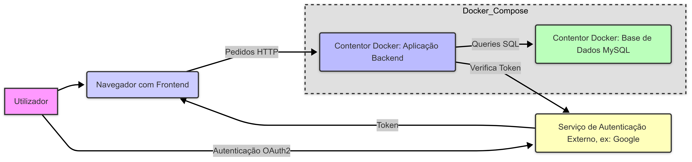

# Capitulo 3 : Produto

Descrição do desenvolvimento, instalação e utilização do produto_

## 3.1 Desenvolvimento

O sistema foi desenvolvido como uma **API RESTful** utilizando o padrão OpenAPI 3.0, tendo como principal objetivo gerir agendamentos de consultas entre pacientes e médicos. A aplicação segue uma arquitetura baseada em camadas, com separação clara entre autenticação, lógica de negócio e acesso a dados.

### Tecnologias principais:
- **Node.js / Express** (servidor backend)
- **JWT** para autenticação
- **Swagger** para documentação da API
- **Base de dados relacional** (ex: PostgreSQL ou MySQL)

### Diagrama da Arquitetura do Sistema

## 3.2 Installation

### Pré-requisitos

- Node.js 18+ instalado
- Mysql
- `npm` para instalar dependências

### Passos de instalação

1. **Clonar o repositório**

- git clone [[https://github.com/inf23dw2g32/M1.git](https://github.com/inf24dw2g32/M1.git)]

2. **Instalação dependências**

- npm install

## 3.3 Utilização

### Autenticação

- Todos os endpoints protegidos requerem autenticação via JWT. Após login, o token será enviado no cabeçalho das requisições.

### Exemplo de requisição autenticada

- curl -H "Authorization: Bearer <token>" http://localhost:3000/users/1/appointments

## 4 Limitações e notas

- Apenas utilizadores autenticados podem aceder a recursos protegidos.
- Algumas rotas exigem permissões de administrador (ex: criar especialidades).
- A API retorna mensagens de erro informativas com códigos HTTP padronizados (401, 403, 404, 500, etc.).
